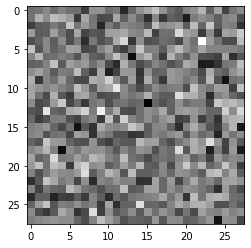
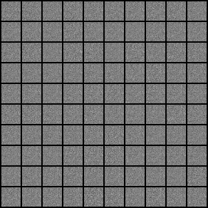
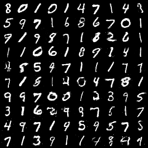
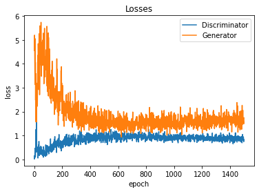
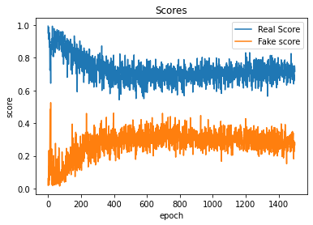

<h1 align="center">
   
  <a style ="color:black; text-decoration:none;" href="https://khalidsaifullaah.github.io/pathfinding-visualizer/">GAN (Generative Adversarial Network)</a>
</h1>

<h4 align="center">The model learns to generate images of digits using MNIST dataset</h4>

  <a href="#live-demo">Live Demo</a> •
  <a href="#development-stack">Development Stack</a> •
  <a href="#brief-info-about-the-algorithms">Brief Info About The Training Process</a> •
<a href="#framework">Framework</a> •
  <a href="#plots">Plots</a>

<h1 align="center"></h1>

## Brief Info About The Training Process

figure 1: generated image without any training

figure 2: generated image at first epoch of training

figure 3: generated image at 50th epoch of training

>> At the very begining the **Generator** model is totally dumb, don't know how to make an image of a digit, thus generates totally noisy, random, fake images [figure 1]. **Discriminator** comes to rescue here, It's job is to discriminate real images of MNIST dataset from the fake images produced by the Generator. Discriminator easily identifies the fake images as they are really terrible at initial epochs [figure 2]. However as time passes, with the help and feedback of Discriminator, Generator starts to get the pattern and produces good fake images that successfully fools the Discriminator

## Framework

## Plots

---

> Stack Overflow [@khalid-saifullah](https://github.com/khalidsaifullaah) &nbsp;&middot;&nbsp;
> GitHub [@khalidsaifullaah](https://github.com/khalidsaifullaah) &nbsp;&middot;&nbsp;
> Facebook [@ikhalidsaifullaah](https://www.facebook.com/ikhalidsaifullaah/) &nbsp;&middot;&nbsp;
> Twitter [@k_saifullaah](https://twitter.com/k_saifullaah) &nbsp;&middot;&nbsp;
> LinkedIn [@khalidsaifullaah](https://www.linkedin.com/in/khalidsaifullaah/)

