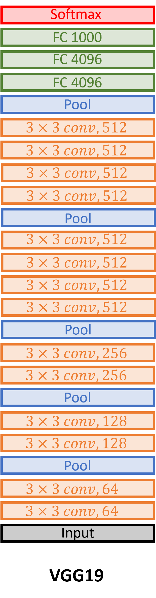

# VGGNet 

The paper of [VGGNet (Very Deep Convolutional Networks for Large-Scale Image Recognition)](https://arxiv.org/abs/1409.1556) took another step ahead the field of computer vision after it's predecessor AlexNet. Though the idea was mostly about increasing the layers (network depth) while downsizing the number of parameters needed to learn. The number of parameters was less then then their predecessor AlexNet. They achieved it by using **_smaller receptive field of 3x3_** throughout the whole network in contrast of 11x11 or 5x5 used in AlexNet. As the authors suggested, if you use two 3x3 opposed to one 5x5 conv layer, **_it keeps the number of parameters small yet increase the discriminative power of the model_** as more non-liniarity kicls-in. I've implemented the 19 layered version of the model, known as **VGGNet18**. The dataset I've used to train the model is **CIFAR-10**.

## Implemented Architecture

figure 1: VGGNet19

## Analysis coming soon...

---

> Stack Overflow [@khalid-saifullah](https://github.com/khalidsaifullaah) &nbsp;&middot;&nbsp;
> GitHub [@khalidsaifullaah](https://github.com/khalidsaifullaah) &nbsp;&middot;&nbsp;
> Facebook [@ikhalidsaifullaah](https://www.facebook.com/ikhalidsaifullaah/) &nbsp;&middot;&nbsp;
> Twitter [@k_saifullaah](https://twitter.com/k_saifullaah) &nbsp;&middot;&nbsp;
> LinkedIn [@khalidsaifullaah](https://www.linkedin.com/in/khalidsaifullaah/)